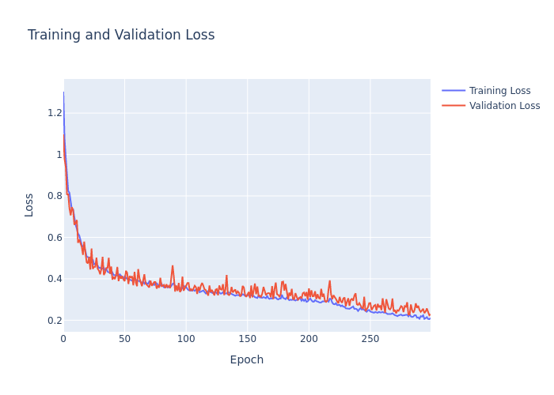

# Sign Invariant Positional Encoded Graphormer

Graphormer is a graph representation learning model designed to encode various graph features, including node centrality, shortest path distances, and eigenvectors/eigenvalues. This repository contains the implementation of the Graphormer model and its components.

The model is based on the papers "Do Transformers Really Perform Bad for Graph Representation?" and "Sign and Basis Invariant Networks for Spectral Graph Representation Learning."

## Table of Contents

- [Installation](#installation)
- [Usage](#usage)
- [Configuration](#configuration)
- [Components](#components)
- [Model Architecture](#model-architecture)
- [Training](#training)
- [Plotting](#plotting)
- [Plots](#plots)
- [Result](#Result-Output)
- [Test MAE](#Test-MAE)
- [caution](#Caution)
- [License](#license)

## Installation

To install the required dependencies, run:

```bash
pip install -r requirements.txt
```

## Usage

To use the Graphormer model, you need to prepare your dataset and configuration. Below is an example of how to initialize and use the model:

```python
from configuration import Config
from phormerModel import Graphormer

cfg = Config()
model = Graphormer(cfg)

# Example input data
node_feat = ...
in_degree = ...
out_degree = ...
path_data = ...
dist = ...
eigenvecs = ...
eigen_value = ...

output = model(node_feat, in_degree, out_degree, path_data, dist, eigenvecs, eigen_value)
```

## Configuration

The configuration for the Graphormer model is defined in the `Config` class in `configuration.py`. You can customize various parameters such as model dimensions, number of layers, dropout rates, and more.

```python
from configuration import Config

cfg = Config()
print(cfg)
```

## Components

### Spatial Encoder

Encodes shortest path distances using an embedding table.

### Centrality Encoder

Encodes node centrality features based on in-degrees and out-degrees.

### Edge Encoder

Encodes edge features along the shortest path.

### Encoder

Consists of multi-head attention and feed-forward network layers.

### SignNet 

SignNet is a new neural architecture that is invariant to key symmetries displayed by eigenvectors: (i) sign flips, since if v is an eigenvector then so is −v.
Encodes eigenvectors and eigenvalues using rho and phi neural networks `f(v1, ..., vk) = ρ(φ1(v1), ..., φk(vk))`.

## Model Architecture

The Graphormer model consists of several key components:

- **Atom Encoder**: Embeds node features.
- **Bond Encoder**: Embeds edge features (if edge encoding is enabled).
- **Centrality Encoder**: Encodes node centrality features based on in-degrees and out-degrees.
- **Spatial Encoder**: Encodes shortest path distances.
- **SignNet**: Encodes eigenvectors and eigenvalues.
- **Encoder Layers**: Stacked layers of multi-head attention and feed-forward networks.
- **Output Layer**: Produces the final graph representation.

The model takes various graph features as input and processes them through these components to generate a graph representation.


## Predictive Model Used


## Training

To train the Graphormer model, you need to prepare your dataset and define the training loop. Below is a simplified example:

```python
from zincdata import ZincDataset
from configuration import Config
from phormerModel import Graphormer

cfg = Config()
dataset = ZincDataset(cfg=cfg)
model = Graphormer(cfg)

# Define your optimizer and loss function
optimizer = torch.optim.Adam(model.parameters(), lr=cfg.lr)
loss_fn = torch.nn.MSELoss()

# Training loop
for epoch in range(num_epochs):
    for batch in dataset.train_loader:
        # Prepare input data
        node_feat, in_degree, out_degree, path_data, dist, eigenvecs, eigen_value = batch

        # Forward pass
        output = model(node_feat, in_degree, out_degree, path_data, dist, eigenvecs, eigen_value)

        # Compute loss
        loss = loss_fn(output, target)

        # Backward pass and optimization
        optimizer.zero_grad()
        loss.backward()
        optimizer.step()
```

## Plotting

To visualize the training and validation losses, you can use the following code snippet to generate and save the plot:

```python
import matplotlib.pyplot as plt

def plot_losses(train_losses, val_losses, save_path='losses_plot.png'):
    plt.figure(figsize=(10, 5))
    plt.plot(train_losses, label='Training Loss')
    plt.plot(val_losses, label='Validation Loss')
    plt.xlabel('Epochs')
    plt.ylabel('Loss')
    plt.legend()
    plt.title('Training and Validation Loss')
    plt.savefig(save_path)
    plt.show()

# Example usage
train_losses = [...]  # List of training losses
val_losses = [...]    # List of validation losses
plot_losses(train_losses, val_losses)
```

## Plots

### Training and Validation Loss Plot [MAE]
### Not Including Sign Invariant Positional Encoding
After training the model, the training and validation losses are plotted and saved as `losses_plot.png`.



## Result Output

### Not Including Sign Invariant Positional Encoding

The result of the model is plotted and saved as `result.png`.


## Test MAE

After training the model for 300 epochs, the test Mean Absolute Error (MAE) achieved is **0.222**. The configuration used is defined in `configuration.py`.

Due to hardware constraints, the training was limited to 300 epochs. Further training on more powerful hardware could potentially improve the performance of the model.

## Caution

Do not use K more than 10 if using eigenvalue as it results in NaN eigenvalue if the number of nodes in the graph is smaller than K. You could find the correct K as graph size is varying, or use all eigenvalue by summing `f(v1, ..., vk) = ρ( SUM(φ1(v1), ..., φk(vk)) )`

### Eigenvector Plot

## License

This project is licensed under the MIT License.
